# Preventia MVP — Enhanced ERD (Mermaid / Crow's Foot)

> **Mermaid note:** `erDiagram` does not support `subgraph` blocks — those are
> exclusive to `flowchart`/`graph` diagrams. Functional clusters are marked with
> comment banners instead. All relationship cardinality uses native Crow's Foot
> notation as rendered by Mermaid's `erDiagram`.

```mermaid
erDiagram

    %% ══════════════════════════════════════════════════════
    %% CLUSTER 1 — User & Auth
    %% Tables: USERS · REFRESH_TOKENS · FAMILY_RELATIONSHIPS
    %%         · FAMILY_MEMBERS
    %% ══════════════════════════════════════════════════════

    USERS {
        bigserial   id              PK
        varchar     name
        varchar     email
        varchar     password
        varchar     role            "RECIPIENT|SPONSOR|DOCTOR|PHARMACIST|ADMIN"
        uuid        nri_proxy_id    "SPONSOR only — proxy identity"
        varchar     abha_id         "ABDM FHIR R4 patient link"
        varchar     google_subject  "OAuth — Google"
        varchar     apple_subject   "OAuth — Apple"
        timestamptz created_at
    }

    REFRESH_TOKENS {
        uuid        id          PK
        bigint      user_id     FK
        varchar     token
        timestamptz expires_at
        timestamptz created_at
    }

    FAMILY_RELATIONSHIPS {
        bigserial   id              PK
        bigint      sponsor_id      FK  "→ users.id (role=SPONSOR)"
        bigint      recipient_id    FK  "→ users.id (role=RECIPIENT)"
        varchar     consent_status  "PENDING|GRANTED|REVOKED"
        timestamptz granted_at      "NULL until GRANTED"
        timestamptz created_at
    }

    FAMILY_MEMBERS {
        bigserial   id              PK
        bigint      owner_user_id   FK  "→ users.id (role=RECIPIENT)"
        varchar     first_name
        varchar     last_name
        date        date_of_birth
        varchar     phone
        varchar     email
        varchar     relationship    "CHILD|PARENT|SPOUSE|OTHER"
        varchar     photo_s3_key
        varchar     care_status     "ACTIVE|CARE_UPDATED|PENDING_LAB|UP_TO_DATE"
        timestamptz created_at
        timestamptz updated_at
    }

    %% ══════════════════════════════════════════════════════
    %% CLUSTER 2 — Marketplace & Ops
    %% Tables: APPOINTMENTS (incl. Daily.co room) · PAYMENTS
    %%         · WEBHOOK_EVENT_LOG
    %% ══════════════════════════════════════════════════════

    APPOINTMENTS {
        bigserial   id              PK
        bigint      recipient_id    FK  "→ users.id (role=RECIPIENT)"
        bigint      sponsor_id      FK  "→ users.id (role=SPONSOR) — nullable"
        bigint      doctor_id       FK  "→ users.id (role=DOCTOR)"
        timestamptz start_time
        timestamptz end_time
        varchar     daily_room_url  "Full Daily.co HTTPS URL"
        varchar     daily_room_name "Short ID — webhook matching key"
        varchar     status          "SCHEDULED|ACTIVE|COMPLETED|LOCKED|CANCELLED|NO_SHOW"
        timestamptz created_at
    }

    PAYMENTS {
        bigserial   id                      PK
        bigint      appointment_id          FK  "→ appointments.id — nullable"
        bigint      payer_id                FK  "→ users.id"
        bigint      amount_cents
        varchar     currency                "USD|INR"
        varchar     gateway                 "STRIPE|RAZORPAY"
        varchar     gateway_payment_id
        varchar     gateway_order_id
        varchar     status                  "PENDING|CAPTURED|FAILED|REFUNDED"
        varchar     payment_type            "CONSULTATION|MEDICATION|LAB_ORDER"
        numeric     exchange_rate_at_capture
        timestamptz created_at
        timestamptz updated_at
    }

    WEBHOOK_EVENT_LOG {
        bigserial   id              PK
        varchar     provider        "daily|razorpay|stripe|thyrocare"
        varchar     endpoint
        varchar     event_type
        varchar     reference_id
        varchar     room_name       "Soft-ref → appointments.daily_room_name"
        int         status_code
        boolean     signature_valid
        text        payload_summary
        timestamptz created_at
    }

    %% ══════════════════════════════════════════════════════
    %% CLUSTER 3 — Clinical Core
    %% Tables: SOAP_NOTES · PRESCRIPTION_AUDIT_LOG
    %%         · LAB_ORDERS · COLD_CHAIN_TEST_CODES
    %% ══════════════════════════════════════════════════════

    SOAP_NOTES {
        bigserial   id                      PK
        bigint      appointment_id          FK  "→ appointments.id — nullable"
        bigint      patient_id              FK  "→ users.id (role=RECIPIENT)"
        bigint      doctor_id               FK  "→ users.id (role=DOCTOR)"
        text        subjective
        text        objective
        text        assessment
        text        plan
        varchar     session_token           "Daily.co token — Safety Rail §7"
        varchar     prescription_s3_key     "Primary PDF (S3 key)"
        text[]      prescription_s3_keys    "All uploaded PDFs (multi-file)"
        varchar     prescription_status     "NONE|PENDING_VERIFICATION|APPROVED|REJECTED|AWAITING_CLARIFICATION|DISPATCHED"
        timestamptz prescription_uploaded_at "SLA clock start"
        timestamptz created_at
        timestamptz updated_at
    }

    PRESCRIPTION_AUDIT_LOG {
        bigserial   id              PK
        bigint      soap_note_id    FK  "→ soap_notes.id"
        bigint      actor_id        FK  "→ users.id — NULL for system actions"
        varchar     action          "UPLOADED|VIEWED|APPROVED|REJECTED|CLARIFICATION_REQUESTED|ORDER_CREATED|DISPATCHED|SLA_BREACH_ESCALATED"
        text        reason
        jsonb       metadata        "orderId, trackingNumber, presignedUrlExpiry…"
        timestamptz created_at
    }

    LAB_ORDERS {
        bigserial   id                  PK
        bigint      appointment_id      FK  "→ appointments.id"
        bigint      patient_id          FK  "→ users.id (role=RECIPIENT)"
        varchar     lab_partner         "THYROCARE|LAL_PATHLABS|METROPOLIS|SRL|LOCAL_ICMR|MANUAL"
        varchar     test_code           "LOINC or proprietary — soft-ref cold_chain_test_codes"
        varchar     test_name
        varchar     external_order_id   "Lab API order ID — webhook key"
        varchar     tracking_id         "Real-time tracking"
        varchar     status              "ORDERED|COLLECTED|IN_TRANSIT|RESULTED|FAILED"
        timestamptz scheduled_at
        timestamptz collected_at
        timestamptz resulted_at
        boolean     requires_cold_chain
        numeric     last_temp_reading
        varchar     temp_unit           "CELSIUS"
        timestamptz temp_logged_at
        boolean     cold_chain_breached
        varchar     result_pdf_key      "S3 key — lab-reports/{patientId}/{orderId}.pdf"
        text        collection_address  "Denormalised snapshot at order time"
        timestamptz created_at
        timestamptz updated_at
    }

    COLD_CHAIN_TEST_CODES {
        varchar     test_code           PK  "LOINC or proprietary"
        varchar     test_name
        numeric     max_temp_celsius
        numeric     min_temp_celsius
        text        notes
        timestamptz created_at
    }

    %% ══════════════════════════════════════════════════════
    %% CLUSTER 4 — Pharmacy
    %% Tables: MEDICATIONS · INVENTORY_AUDIT_LOG
    %% ══════════════════════════════════════════════════════

    MEDICATIONS {
        bigserial   id              PK
        bigint      patient_id      FK  "→ users.id (role=RECIPIENT)"
        varchar     drug_name
        int         total_quantity  "Current stock on hand"
        int         daily_dosage    "Units/day — computes days remaining"
        numeric     unit_price_inr  "Razorpay refill flow"
        timestamptz updated_at
        timestamptz created_at
    }

    INVENTORY_AUDIT_LOG {
        bigserial   id              PK
        bigint      medication_id   FK  "→ medications.id"
        int         quantity_before
        int         quantity_after
        varchar     source          "SYSTEM|SAHAYAK|USER"
        bigint      actor_id        FK  "→ users.id — NULL for SYSTEM"
        text        note
        timestamptz created_at
    }


    %% ══════════════════════════════════════════════════════
    %% RELATIONSHIPS
    %% ══════════════════════════════════════════════════════

    %% — User & Auth ————————————————————————————————————————
    USERS                ||--o{ REFRESH_TOKENS          : "authenticates via"
    USERS                ||--o{ FAMILY_RELATIONSHIPS     : "initiates as sponsor"
    USERS                ||--o{ FAMILY_RELATIONSHIPS     : "receives consent as recipient"
    USERS                ||--o{ FAMILY_MEMBERS           : "manages dependents"

    %% — Marketplace & Ops ——————————————————————————————————
    USERS                ||--o{ APPOINTMENTS             : "attends as recipient"
    USERS                |o--o{ APPOINTMENTS             : "observes as sponsor"
    USERS                ||--o{ APPOINTMENTS             : "conducts as doctor"
    APPOINTMENTS         ||--o{ PAYMENTS                 : "billed via"
    USERS                ||--o{ PAYMENTS                 : "pays"

    %% Daily.co soft-link (no formal FK — matched by room_name at runtime)
    APPOINTMENTS         |o--o{ WEBHOOK_EVENT_LOG        : "matched by room_name"

    %% — Clinical Core ——————————————————————————————————————
    APPOINTMENTS         ||--o{ SOAP_NOTES               : "generates EMR notes"
    USERS                ||--o{ SOAP_NOTES               : "documented for (patient)"
    USERS                ||--o{ SOAP_NOTES               : "authored by (doctor)"
    SOAP_NOTES           ||--o{ PRESCRIPTION_AUDIT_LOG   : "audited by"
    USERS                |o--o{ PRESCRIPTION_AUDIT_LOG   : "acted on by"
    APPOINTMENTS         ||--o{ LAB_ORDERS               : "triggers lab order"
    USERS                ||--o{ LAB_ORDERS               : "ordered for (patient)"
    COLD_CHAIN_TEST_CODES |o--o{ LAB_ORDERS              : "governs cold chain for"

    %% — Pharmacy ———————————————————————————————————————————
    USERS                ||--o{ MEDICATIONS              : "prescribed to (patient)"
    MEDICATIONS          ||--o{ INVENTORY_AUDIT_LOG      : "stock tracked by"
    USERS                |o--o{ INVENTORY_AUDIT_LOG      : "adjusted by (actor)"
```

---

## Relationship Legend (Crow's Foot)

| Symbol | Meaning |
|--------|---------|
| `\|\|` | Exactly one |
| `\|o` | Zero or one |
| `o{` | Zero or many |
| `\|{` | One or many |

---

## Flows Not in the Original Request (Captured from Schema)

| Flow | Tables Involved | Notes |
|------|----------------|-------|
| **Token Rotation** | `refresh_tokens` | Issued on login; consumed + rotated on `/auth/refresh`. Cascade-deleted on user delete. |
| **Social Auth** | `users.google_subject / apple_subject` | Google + Apple Sign-In; unique sparse indexes. |
| **ABDM / ABHA Linking** | `users.abha_id` | 14-digit ABHA number for FHIR R4 HIE (`Patient/$match`). |
| **Lab Cold Chain Monitoring** | `lab_orders` ↔ `cold_chain_test_codes` | Soft-ref on `test_code`; breach flag triggers ops alert. |
| **Multi-file Prescriptions** | `soap_notes.prescription_s3_keys TEXT[]` | V14 — array of S3 keys, primary key mirrors `prescription_s3_key`. |
| **Webhook Event Ingestion** | `webhook_event_log` | Captures Daily.co, Razorpay, Stripe, Thyrocare events. Matched to appointments via `room_name`. |
| **Inventory Audit (SAHAYAK)** | `inventory_audit_log` | Physical care assistant counts captured with `source=SAHAYAK`. |
| **Family Member Dependents** | `family_members` | RECIPIENT-owned sub-profiles (not full accounts). Different from tri-party `family_relationships`. |
| **Prescription SLA Escalation** | `prescription_audit_log.action = SLA_BREACH_ESCALATED` | System-fires when PENDING_VERIFICATION > 4 hours. `actor_id` is NULL. |
| **Admin Role** | `users.role = ADMIN` | Added V11; no dedicated admin table — RBAC enforced at Spring Security layer. |
