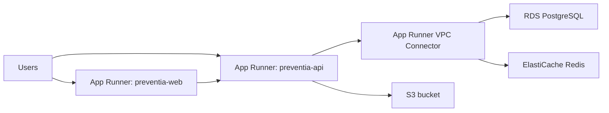

# Preventia MVP — AWS Deployment Guide

## Architecture

The current deployed topology is documented in:

- [REFERENCE_ARCHITECTURE.md](/Users/satishjonnala/Documents/Dhanvantri/preventia-mvp/ops/aws/REFERENCE_ARCHITECTURE.md)
- [REFERENCE_ARCHITECTURE_C4.md](/Users/satishjonnala/Documents/Dhanvantri/preventia-mvp/ops/aws/REFERENCE_ARCHITECTURE_C4.md)
- [preventia-aws-reference-architecture.svg](/Users/satishjonnala/Documents/Dhanvantri/preventia-mvp/ops/aws/assets/preventia-aws-reference-architecture.svg)

High level:



## Services

| Service | AWS Component | Purpose |
|---------|--------------|---------|
| Spring Boot API | App Runner | Stateless backend, auto-scales |
| Next.js Frontend | App Runner | SSR frontend, auto-scales |
| PostgreSQL | RDS (db.t4g.micro) | Primary data store |
| Redis | ElastiCache (cache.t4g.micro) | Session cache |
| Docker images | ECR | Private container registry |
| Secrets | Secrets Manager | All credentials |
| Static files / prescriptions | S3 | File storage |
| CDN / custom edge | Not currently provisioned | CloudFront / WAF not yet part of the live stack |

## Prerequisites

1. AWS CLI v2 installed and configured (`aws configure`)
2. Docker or Podman installed locally
3. Account ID: `246599827879`
4. Region: `ap-south-1` (Mumbai)

## Deployment Steps

### Step 0 — Create the deploy IAM user
Run this once with an existing admin-capable AWS profile. It creates `preventia-deploy`
and applies the checked-in policy at `ops/aws/iam/preventia-deploy-bootstrap-policy.json`.
```bash
cd ops/aws
chmod +x *.sh
export AWS_PROFILE=<admin-capable-profile>
./00-setup-deploy-iam.sh
aws configure --profile preventia
aws sts get-caller-identity --profile preventia
```

### Step 1 — One-time infrastructure setup
```bash
cd ops/aws
chmod +x *.sh
export AWS_PROFILE=preventia
./01-setup-ecr.sh          # Create ECR repositories
./02-setup-rds.sh          # Create RDS PostgreSQL
./03-setup-elasticache.sh  # Create Redis cluster
./03a-setup-storage-iam.sh # Create S3 bucket + app IAM access keys
./04-setup-secrets.sh      # Store all secrets in Secrets Manager
./04a-setup-vpc-connector.sh # Create private subnets, NAT, and App Runner VPC connector
```

### Step 2 — First deployment
```bash
./deploy.sh both           # Build and push initial images to ECR
./05-setup-apprunner.sh    # Create both App Runner services
./deploy.sh web            # Rebuild web with the live API URL baked in
```

### Step 3 — Normal releases
```bash
./deploy.sh                # Build → Push → Deploy both services
```

### Step 4 — Verify
```bash
./verify.sh                # Health check both services
```

## Environment Variables Required

Copy `.env.aws.example` and fill in before running `04-setup-secrets.sh`:
```bash
cp .env.aws.example .env.aws
```

`03a-setup-storage-iam.sh` can write the following values into `.env.aws` for you:
- `S3_BUCKET_NAME`
- `AWS_ACCESS_KEY_ID_APP`
- `AWS_SECRET_ACCESS_KEY_APP`

`04a-setup-vpc-connector.sh` provisions:
- 3 private subnets in the default VPC
- 1 NAT gateway and Elastic IP
- 1 App Runner VPC connector named `preventia-vpc-connector`

This NAT gateway adds recurring AWS cost beyond the base estimate below.

If you still use the legacy AWS CLI profile on this machine, export it before deploy:
```bash
export AWS_PROFILE=preventia
```

## Cost Estimate (ap-south-1, low traffic)

| Component | Instance | Monthly (~) |
|-----------|----------|-------------|
| App Runner API | 0.25 vCPU / 0.5 GB | ~$5–15 |
| App Runner Web | 0.25 vCPU / 0.5 GB | ~$5–15 |
| RDS PostgreSQL | db.t4g.micro | ~$15 |
| ElastiCache | cache.t4g.micro | ~$12 |
| CloudFront | ~10 GB/mo | ~$1 |
| ECR storage | ~2 GB | ~$0.20 |
| **Total** | | **~$38–58/mo** |
