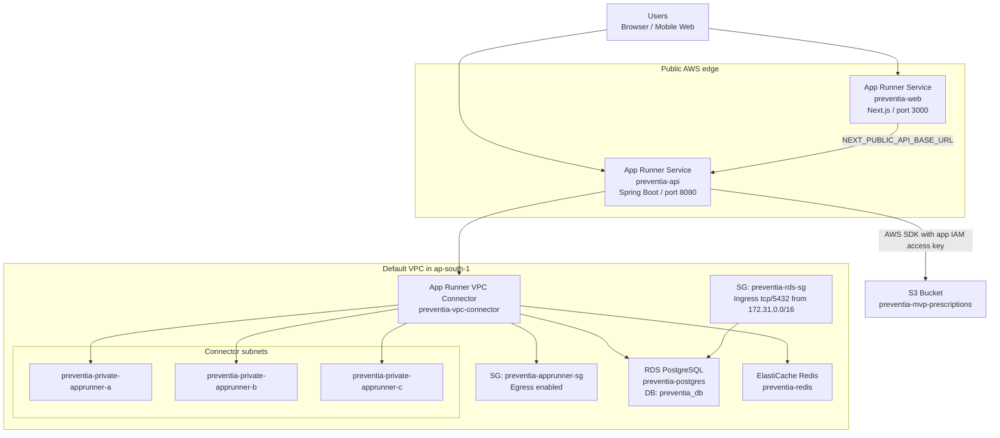
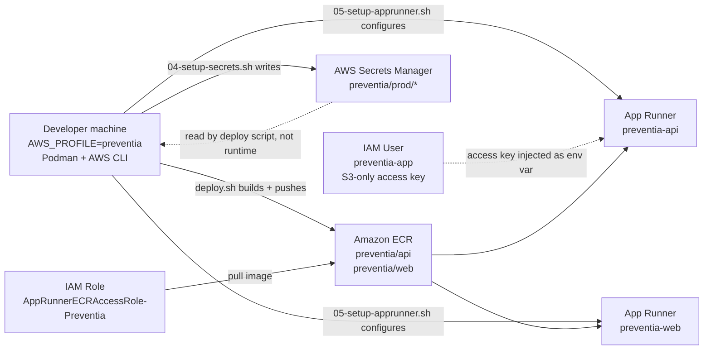

# Preventia AWS Reference Architecture

This document reflects the actual AWS hosting model used by the current `ops/aws` scripts and the live Preventia deployment.

It is intentionally split into:
- runtime/data plane: how user traffic reaches the app
- deployment/control plane: how code and secrets are pushed into AWS

If you want a cleaner system-context/container version, see:
- [REFERENCE_ARCHITECTURE_C4.md](/Users/satishjonnala/Documents/Dhanvantri/preventia-mvp/ops/aws/REFERENCE_ARCHITECTURE_C4.md)

## Runtime Architecture

## Deployment Architecture

## What Is Actually Running

### Public services

- `preventia-web`
  - AWS service: App Runner
  - workload: Next.js web client
  - public URL: App Runner generated domain

- `preventia-api`
  - AWS service: App Runner
  - workload: Spring Boot API
  - public URL: App Runner generated domain
  - outbound traffic: VPC egress via `preventia-vpc-connector`

### Data services

- `preventia-postgres`
  - AWS service: RDS PostgreSQL
  - database: `preventia_db`
  - master user: `preventia_admin`
  - network: default VPC with `preventia-db-subnet-group`

- `preventia-redis`
  - AWS service: ElastiCache Redis
  - purpose: cache / Redis-backed app features

- `preventia-mvp-prescriptions`
  - AWS service: S3
  - purpose: prescription and uploaded asset storage

### Supporting services

- `preventia/api` and `preventia/web`
  - AWS service: ECR
  - purpose: container registry for App Runner images

- `preventia/prod/db`
- `preventia/prod/redis`
- `preventia/prod/jwt`
- `preventia/prod/daily`
- `preventia/prod/stream`
- `preventia/prod/aws-app`
- `preventia/prod/razorpay`
  - AWS service: Secrets Manager
  - purpose: deployment-time source of secrets

### IAM identities

- `preventia-deploy`
  - purpose: runs infra and deploy scripts from a developer machine

- `AppRunnerECRAccessRole-Preventia`
  - purpose: lets App Runner pull images from ECR

- `preventia-app`
  - purpose: runtime S3 access for the API
  - note: this is currently access-key based, injected as env vars

## Important Networking Notes

### Current network path

- `preventia-api` is public on App Runner, but its outbound dependency traffic is routed into the VPC through `preventia-vpc-connector`.
- The VPC connector uses private subnets plus `preventia-apprunner-sg`.
- RDS allows Postgres access through `preventia-rds-sg`.

### Why the VPC connector exists

App Runner can serve public traffic by itself, but RDS and Redis live inside the VPC. The connector is what allows the API service to open private network connections to those data services.

### NAT / Internet Gateway

- The current scripts make NAT optional.
- Core Preventia hosting does not require NAT to reach RDS and Redis.
- If the API needs outbound internet through the VPC path for third-party APIs, a working Internet Gateway + NAT path may still be required depending on the App Runner egress design you choose.

## Resource Name Reference

| Layer | Resource name |
|---|---|
| Web service | `preventia-web` |
| API service | `preventia-api` |
| VPC connector | `preventia-vpc-connector` |
| Connector security group | `preventia-apprunner-sg` |
| DB security group | `preventia-rds-sg` |
| RDS instance | `preventia-postgres` |
| DB subnet group | `preventia-db-subnet-group` |
| Redis cluster | `preventia-redis` |
| S3 bucket | `preventia-mvp-prescriptions` |
| ECR API repo | `preventia/api` |
| ECR Web repo | `preventia/web` |
| App IAM user | `preventia-app` |
| Deploy IAM user | `preventia-deploy` |

## Current Gaps / Future Improvements

- CloudFront, Route53, and WAF are not part of the current deployed path.
- The API currently uses static app access keys for S3; a service role would be cleaner.
- The VPC design is using the default VPC for speed, not a dedicated production VPC module.
- A proper infrastructure-as-code layer would be safer than shell-only bootstrap over time.
