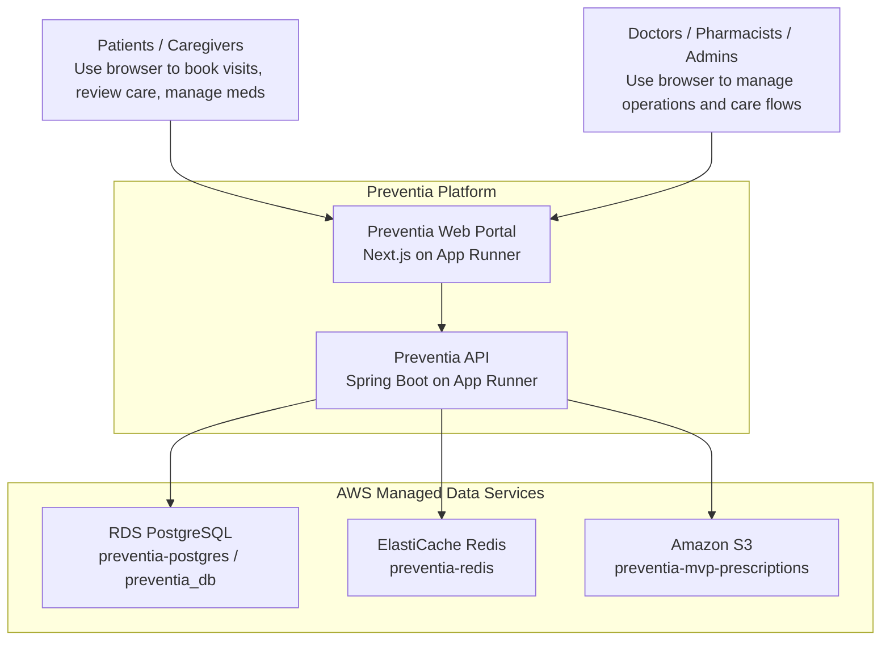
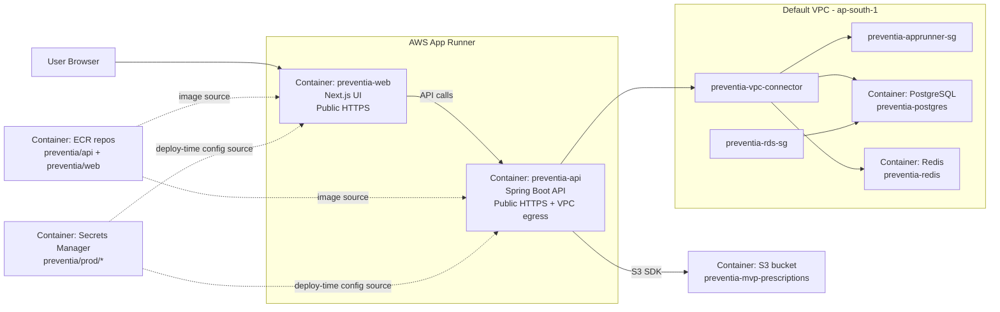
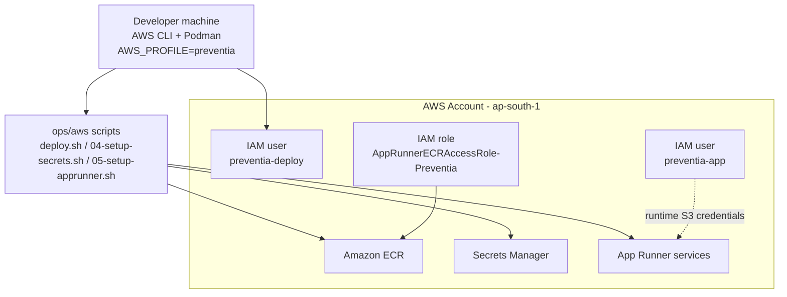

# Preventia AWS Reference Architecture - C4 Style

This is a cleaner, C4-style reference for the current Preventia AWS setup.

Use it alongside [REFERENCE_ARCHITECTURE.md](/Users/satishjonnala/Documents/Dhanvantri/dhanvanthri-mvp/ops/aws/REFERENCE_ARCHITECTURE.md):
- `REFERENCE_ARCHITECTURE.md` = operational/runtime wiring
- `REFERENCE_ARCHITECTURE_C4.md` = cleaner system-context and container views

## System Context

## Container View

## Deployment / Control View

## Reading Guide

- System Context: who uses Preventia and which AWS-managed stores it depends on.
- Container View: the main runtime building blocks and network path.
- Deployment / Control View: how engineers push code and configuration into AWS.

## Current Scope

- This reflects the currently deployed stack.
- It does not include CloudFront, Route53, WAF, or a dedicated production VPC.
- It assumes App Runner remains the public entry point for both web and API.
